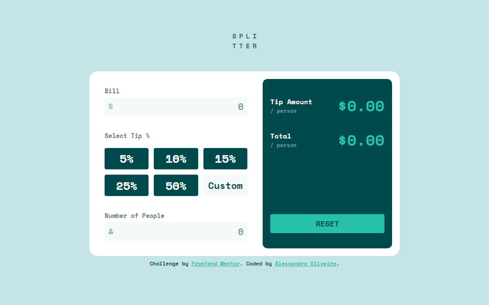
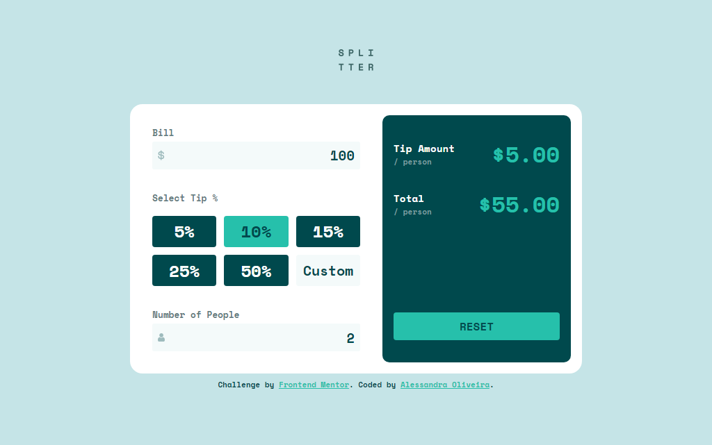
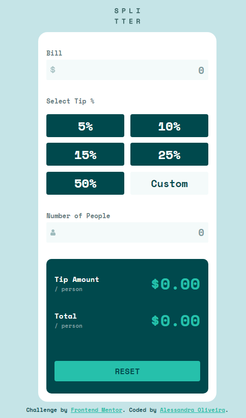

# Frontend Mentor - Tip Calculator App Solution

This is a solution to the [Tip calculator app challenge on Frontend Mentor](https://www.frontendmentor.io/challenges/tip-calculator-app-ugJNGbJUX).

## Table of contents

- [Overview](#overview)
  - [The challenge](#the-challenge)
  - [Screenshot](#screenshot)
  - [Links](#links)
- [My process](#my-process)
  - [Built with](#built-with)
- [Author](#author)

## Overview

This is my solution to the tip calculator app challenge. It was built entirely with HTML, CSS and JavaScript.

### The challenge

Users should be able to:

- View the optimal layout for the app depending on their device's screen size
- See hover states for all interactive elements on the page
- Calculate the correct tip and total cost of the bill per person

### Screenshot

**Desktop Solution**

**Desktop Solution (Completed)**

**Mobile Solution**

### Links

- To see the solution on Frontend Mentor [click here](https://your-solution-url.com)
- To see the live site [click here](https://your-live-site-url.com)

## My process

### Built with

- Semantic HTML5 markup
- CSS custom properties
- JavaScript

## Author

- LinkedIn - [Alessandra Oliveira](https://www.linkedin.com/in/alessandra-santos-oliveira/)
- Frontend Mentor - [@itsale-o](https://www.frontendmentor.io/profile/itsale-o)
- Twitter - [@itsale_o](https://www.twitter.com/itsale_o)
